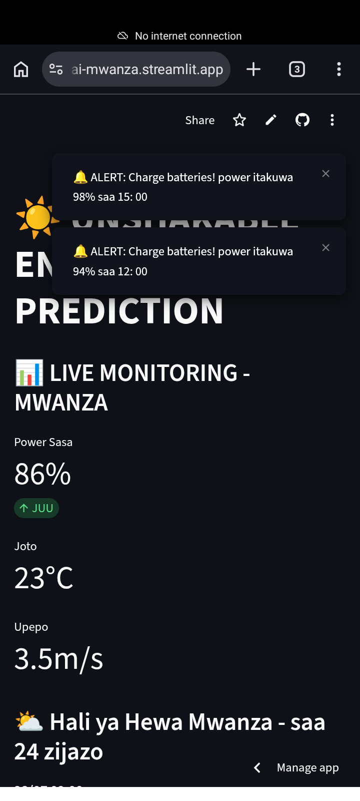
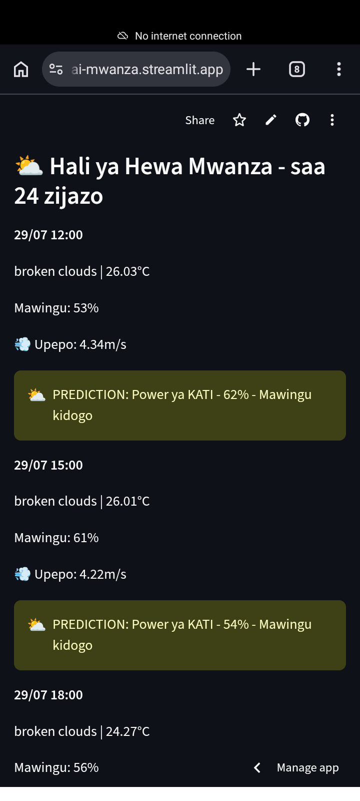
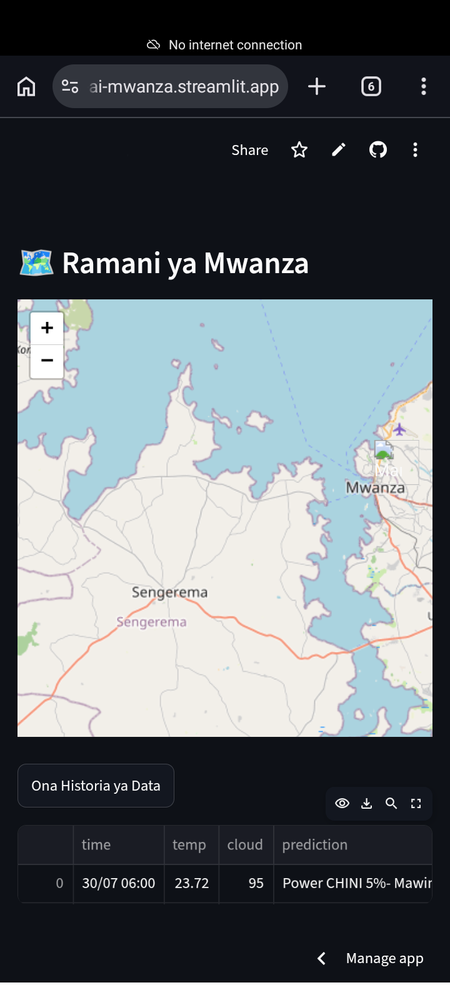

strugglesglesSolar Prediction App - Mwanza, Tanzania

Self - taught AI Engineer solving power prediction for TANESCO Lake Zone.

## The Problem
TANESCO struggles to predict how many KW solar will produce tomorrow,this causing blackout.

## The Solution 
An AI Dashboard that predict Solar power every hour with 90%+ accuracy.

### Key Feature:
- **Live Dashboard** : Current power 86%
- **Smart Alert**, "Charge batteries, Power itakuwa 93% SAA 15:00
- **Map coverage** Mwanza + Sengerema
- **24 Hours Prediction**: JUU, CHINI, SIFURI.

## Demo 
*Watch 45s Demo Video*:https://youtube.com/shorts/jMhY_vOQWs4?si=Sn5Lf2Hf89iup3gj

## Live Website
**Dashboard Link**: https://selemansolar-ai.github.io/ai-solar-mwanza

Live App: https://unshakable-energy-ai-mwanza.streamlit.app

##Screenshots

## Contact
**Seleman Maganga Michael**
AI Solar Engineer - Mwanza
Email: magangamichaelseleman@gmail.com

phone: 0775049026

*Built with python, Azure AI and Streamlit*
